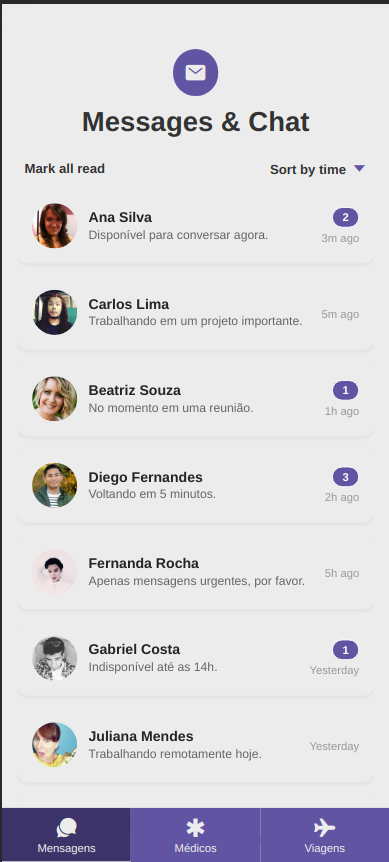

## Atividade 5 - IFPE | Programação para Dispositivos Móveis

**Docente: Nilson Cândido**
**Discente: Heitor Fidelis**

# Capturas de tela

# Como executar?

**1 - Executar servidor utilizando `json-server`**
> `$ cd server`

> `$ npm i`

> `$ npm run start`
> Agora o servidor utilizando json-server está disponível em http://localhost:8000

**2 - Executar mobile em modo de desenvolvimento para o navegador web**

> `$ cd app`

> `$ npm i`

> `$ npm run web`

> Agora o app está disponível em http://localhost:8081